# Project_template

Это шаблон для решения проектной работы. Структура этого файла повторяет структуру заданий. Заполняйте его по мере работы над реш

ением.

# Задание 1. Анализ и планирование

<aside>
💡

Чтобы составить документ с описанием текущей архитектуры приложения, можно часть информации взять из описания компани и условия задания. Это нормально.

</aside>

### 1. Описание функциональности монолитного приложения

**Управление отоплением:**

- Пользователи могут проверять температуру подключенных датчиков.
- Система поддерживает получение и отображение данных с подключенных датчиков.
- Для взаимодействия с пользователем предусмотрен веб интерфейс.
- Автоматическое подключение нового датчика пользователем невозможно, требуется выезд тех. специалиста системы. 

**Мониторинг температуры:**

- Пользователи могут управлять отоплением с помощью специального реле, подключенного к системе.
- Система поддерживает настройку и управление реле.
- Для взаимодействия с пользователем предусмотрен веб интерфейс.
- Автоматическое подключение нового реле пользователя невозможно, требуется выезд тех. специалиста системы.

### 2. Анализ архитектуры монолитного приложения

Архитектура приложения представляет из себя монолит на Java с СУБД Postgres. Всё синхронно. 
Никаких асинхронных вызовов, микросервисов и реактивного взаимодействия в системе нет. 
Всё управление идёт от сервера к датчику. 
Данные о температуре также получаются через запрос от сервера к датчику.

- **Язык программирования:** Java
- **База данных:** PostgreSQL
- **Архитектура:** Монолитная, все компоненты системы (обработка запросов, бизнес-логика, работа с данными) находятся в рамках одного приложения.
- **Взаимодействие:** Синхронное, запросы обрабатываются последовательно.
- **Масштабируемость:** Ограничена, так как монолит сложно масштабировать по частям.
- **Развёртывание:** Требует остановки всего приложения.

### 3. Определение доменов и границы контекстов
Домен - Умный Дом, поддомены: 
- Администрирование - управление пользователями, подключение новых устройств пользователей.
  - ctx: управление пользователями (crud пользователей)
  - ctx: управление устройствами (настройка и подключение устройств)
- Мониторинг (Датчики) - сбор и отображение информации с датчиков пользователей
  - ctx: сбор и хранение метрик с датчиков 
  - ctx: получение и отображение метрик
- Управление (Реле) - настройка и управление реле
  - ctx: настройка и выполнение сценариев на стороне модуля управления и системы (предполагаем, что часть функциональности может реализовываться модулем управления, а часть системой. Например: подача команды на включение отопления на основании показаний датчика самим модулем управления автоматически или на основе команды от системы, которая опрашивает датчик температуры и подает команду модулю управления в момент, когда необходимо включить отопление)
  - ctx: взаимодействие с модулем управления

Поскольку функциональность системы ограничена и имеет узкую специализацию, дальнейшую детализацию не проводим.

### **4. Проблемы монолитного решения**

- система работает на единой реляционной базе и имеет слабый потенциал к масштабированию.
- варианты подключаемых устройств жестко закодированы в системе, их дальнейшее расширение затруднительно.
- при потенциальном росте количества подключаемых видов устройств, растет сложность сопровождения и тестирования, при доработках есть риски влияния на не связанную с доработками функциональность.
- монолитная система имеет сложности с масштабированием доработок, параллельная разработка и внедрение новых фич затруднена или невозможна.
- система представлена монолитом и имеет проблемы с доступностью, отказо(катастрофо)устойчивостью.
- монолитные системы как правило не имеют развитого CI/CD, что дополнительно влияет на скорость и качество разработки системы (пример: обновление требует остановки всего приложения).

### 5. Визуализация контекста системы — диаграмма С4

Добавьте сюда диаграмму контекста в модели C4.

[as_is_context_c4.puml](project_c4/context/as_is_context_c4.puml)

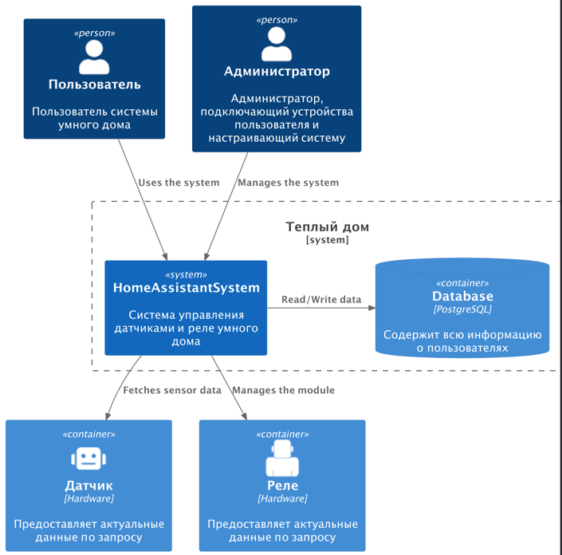

# Задание 2. Проектирование микросервисной архитектуры

В этом задании вам нужно предоставить только диаграммы в модели C4. Мы не просим вас отдельно описывать получившиеся микросервисы и то, как вы определили взаимодействия между компонентами To-Be системы. Если вы правильно подготовите диаграммы C4, они и так это покажут.

Поскольку домен усложнился в соответствии с новыми требованиями бизнеса, была подготовлена развернутая диаграмма контекста TO BE, получена на основе развитие диаграммы as is:

[to_be_context_c4.puml](project_c4/context/to_be_context_c4.puml)

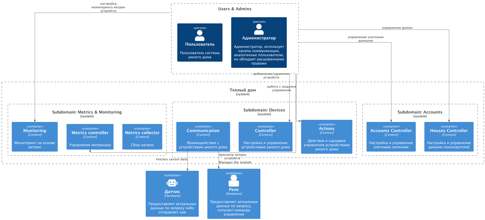

**Диаграмма контейнеров (Containers)**

[to_be_container_c4.puml](project_c4/container/to_be_container_c4.puml)

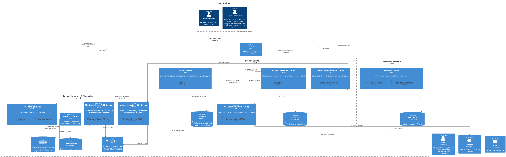

Некоторые контексты ограничены, поскольку на текущем этапе нет необходимости дальнейшего разбиения и ресурсы команды ограничены.
Диаграмма была отрисована средствами plantuml, группировка элементов помогла несколько улучшить ситуацию, но последствия автоматической отрисовки прослеживаются все равно.

**Диаграмма компонентов (Components)**

**Account Service:**

[to_be_component_account_srv_c4.puml](project_c4/component/to_be_component_account_srv_c4.puml)

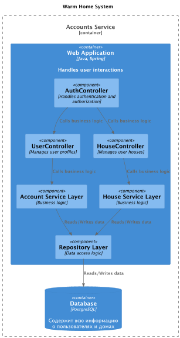

**Push Communication Service:**

[to_be_component_push_communication_srv_c4.puml](project_c4/component/to_be_component_push_communication_srv_c4.puml)

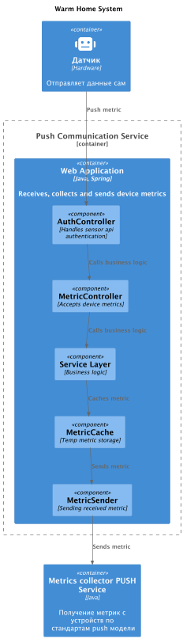

**Pull Communication Service:**

[to_be_component_pull_communication_srv_c4.puml](project_c4/component/to_be_component_pull_communication_srv_c4.puml)

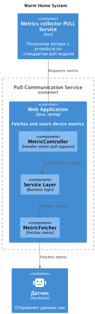

**Device Controller Service:**

[to_be_component_device_controller_srv_c4.puml](project_c4/component/to_be_component_device_controller_srv_c4.puml)

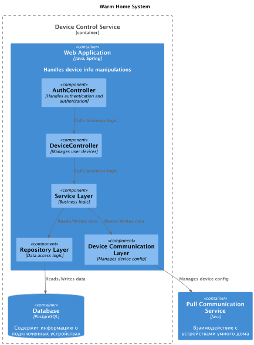

**Actions Service:**

[to_be_component_actions_srv_c4.puml](project_c4/component/to_be_component_actions_srv_c4.puml)

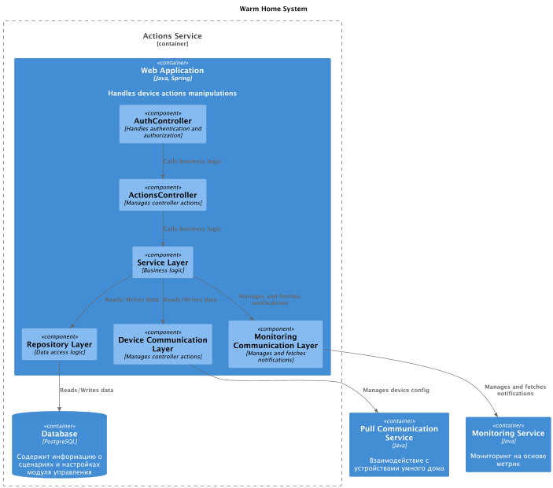

**Metric Collector PULL Service:**

[to_be_component_metrics_pull_collector_srv_c4.puml](project_c4/component/to_be_component_metrics_pull_collector_srv_c4.puml)

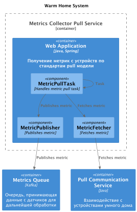

**Metric Collector PUSH Service:**

[to_be_component_metrics_push_collector_srv_c4.puml](project_c4/component/to_be_component_metrics_push_collector_srv_c4.puml)

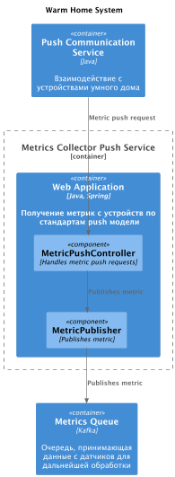

**Monitoring Service:**

[to_be_component_monitoring_srv_c4.puml](project_c4/component/to_be_component_monitoring_srv_c4.puml)

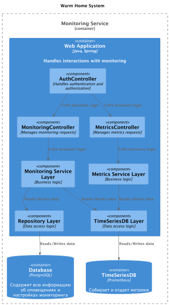

**Metrics Exporter:**

Предполагается воспользоваться существующими решениями по экспорту kafka -> prometheus, разработки нет.

# Задание 3. Разработка ER-диаграммы

[to_be_er.puml](to_be_er.puml)

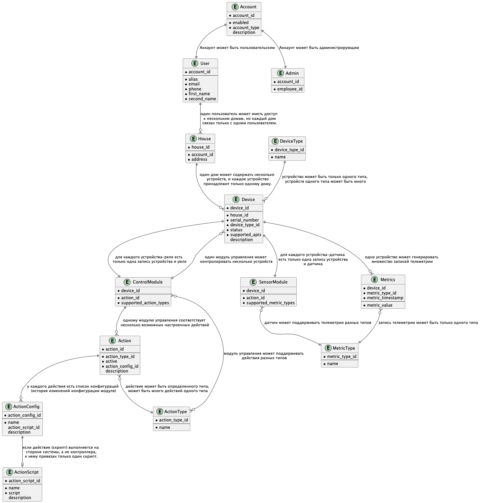

# ❌ Задание 4. Создание и документирование API

### 1. Тип API

Укажите, какой тип API вы будете использовать для взаимодействия микросервисов. Объясните своё решение.

### 2. Документация API

Здесь приложите ссылки на документацию API для микросервисов, которые вы спроектировали в первой части проектной работы. Для документирования используйте Swagger/OpenAPI или AsyncAPI.